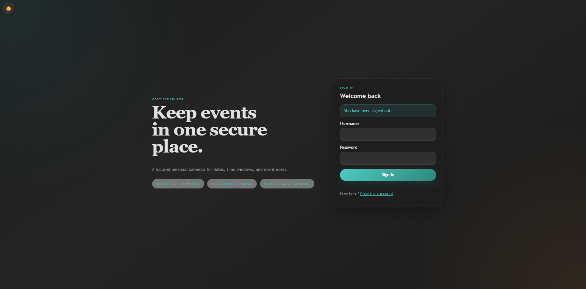
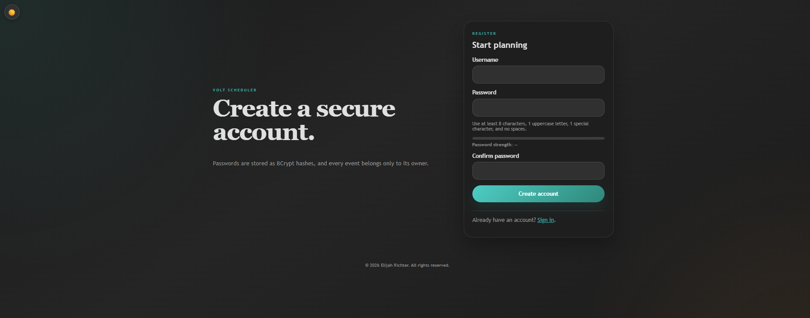
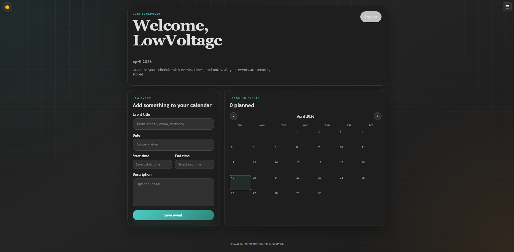
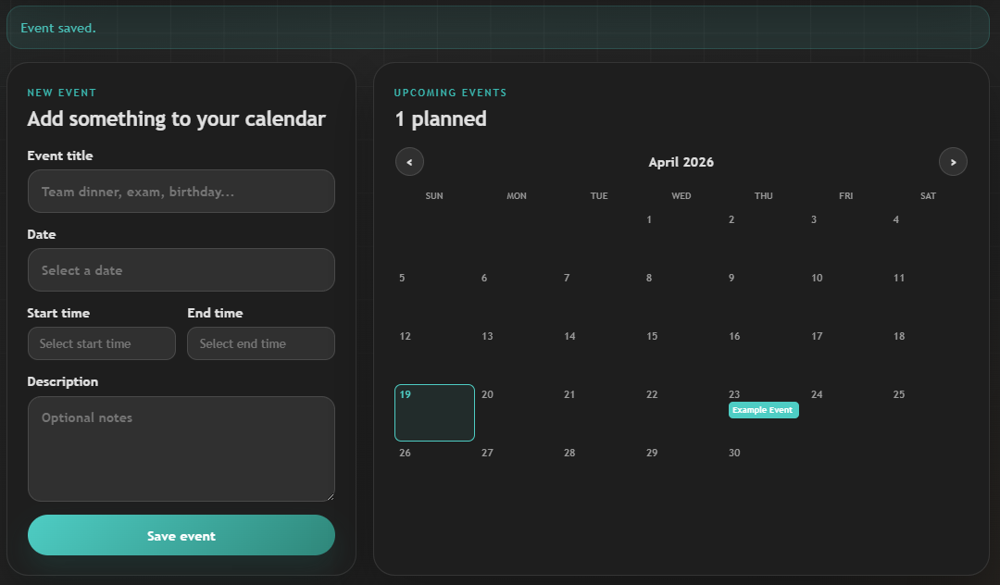
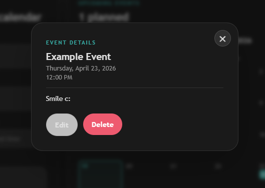

# Volt Scheduler

**Live app:** [low-voltage.xyz/scheduler](https://low-voltage.xyz/scheduler)

A full-stack Java scheduling application built with Spring Boot, Thymeleaf, PostgreSQL, and Docker Compose.

## Features

- Account registration with unique usernames.
- BCrypt password hashing for stored credentials.
- Per-user event management with create, update, and delete flows.
- Required event title and date.
- Optional start time, end time, and description.
- Responsive, modern UI built with server-rendered templates and custom CSS.

## Stack

- Java 25
- Spring Boot 3.5
- Spring Security
- Spring Data JPA
- Thymeleaf
- PostgreSQL
- Docker Compose

## Prerequisites

- Java 25
- Maven
- Docker (for the database or full-stack run)

## Run locally with Maven

1. Start PostgreSQL with Docker:

   ```bash
   docker compose up db -d
   ```

2. Run the application from the project root:

   ```bash
   mvn spring-boot:run
   ```

3. Open `http://localhost:8080`

The application uses these default database settings unless overridden with environment variables:

- `SPRING_DATASOURCE_URL=jdbc:postgresql://localhost:5432/calendar_app`
- `SPRING_DATASOURCE_USERNAME=calendar_user`
- `SPRING_DATASOURCE_PASSWORD=calendar_pass`

> **Warning:** The default credentials are for local development only. Always override `SPRING_DATASOURCE_USERNAME` and `SPRING_DATASOURCE_PASSWORD` with strong values before deploying to any public environment.

## Run with Docker Compose

```bash
docker compose up --build
```

This starts both the Spring Boot app and PostgreSQL.

## Deploy to your own domain

Use the production guide in `DEPLOYMENT.md` to deploy this app to a subdomain like `calendar.yourdomain.com` with HTTPS.

## Screenshots

<table>
   <tr>
      <td align="center"><strong>Login Page</strong></td>
      <td align="center"><strong>Register Page</strong></td>
   </tr>
   <tr>
      <td></td>
      <td></td>
   </tr>
   <tr>
      <td align="center"><strong>Events Page</strong></td>
      <td align="center"><strong>Change Username Page</strong></td>
   </tr>
   <tr>
      <td></td>
      <td></td>
   </tr>
   <tr>
      <td align="center"><strong>Change Password Page</strong></td>
      <td align="center"><strong>Delete Account Page</strong></td>
   </tr>
   <tr>
      <td></td>
      <td></td>
   </tr>
   <tr>
      <td align="center"><strong>Calendar Display</strong></td>
      <td align="center"><strong>Event Display</strong></td>
   </tr>
   <tr>
      <td></td>
      <td></td>
   </tr>
</table>

## License

This project is licensed under the [MIT License](LICENSE).